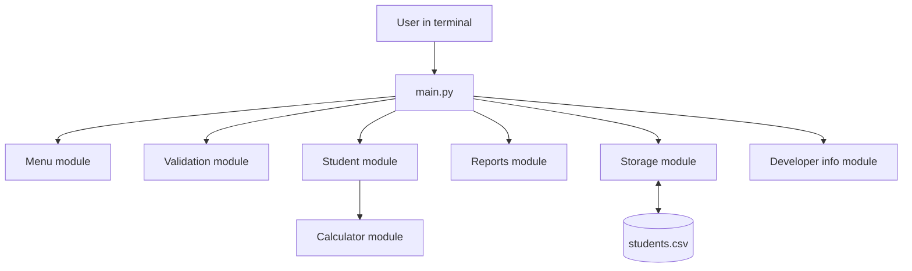
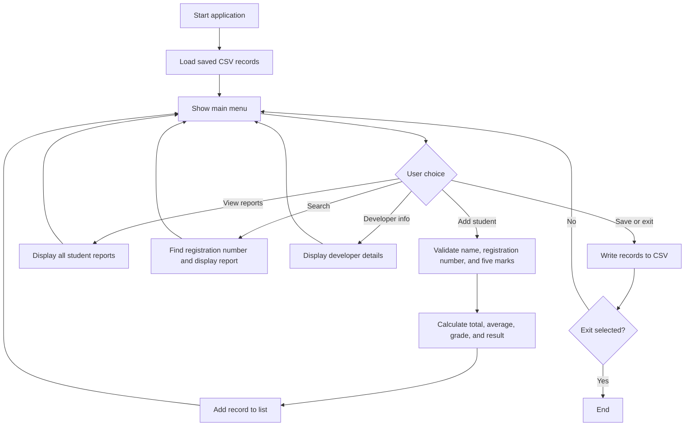
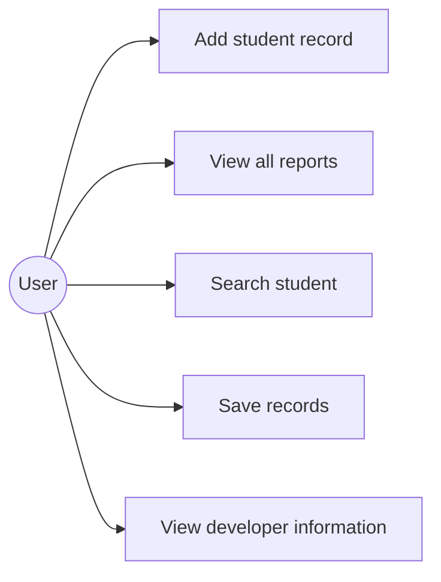
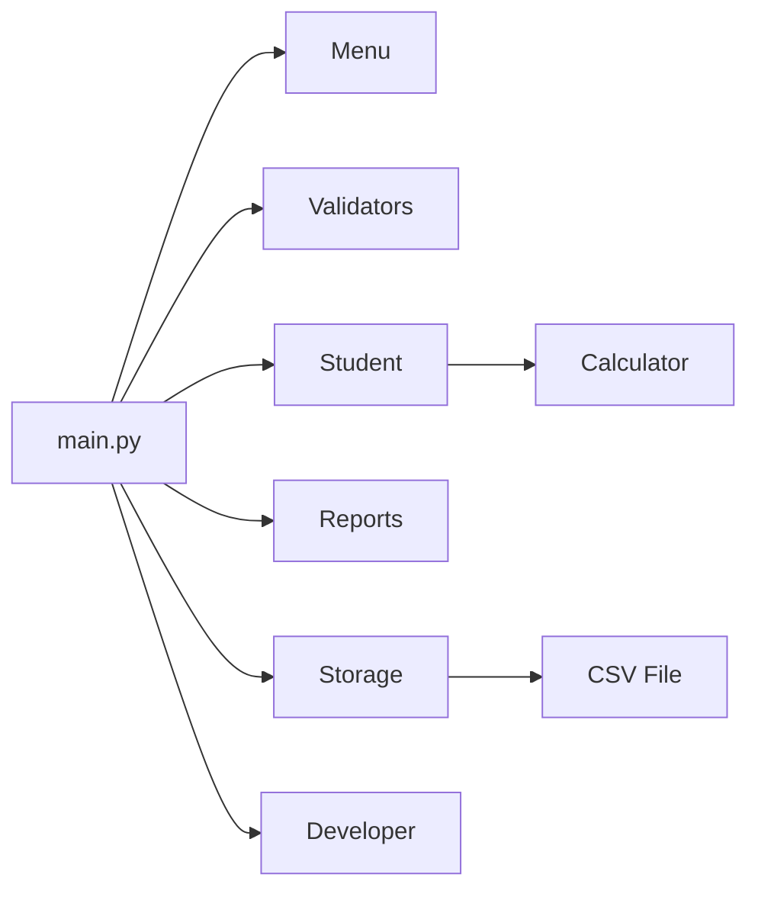

# System Design

## Architecture diagram

## Workflow diagram

## Use-case diagram

## Component diagram

## Storage design

The program uses one CSV file, `data/students.csv`. Each row stores a student's name, registration number, and five subject/mark pairs. Calculated values are generated again when the file is loaded; this avoids storing duplicate values that could become inconsistent.

| Field group | Description |
|---|---|
| `name`, `registration_number` | Student identity fields |
| `subject_1` to `subject_5` | Names of the five subjects |
| `mark_1` to `mark_5` | Whole-number marks from 0 to 100 |

